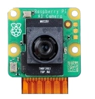

# *SOLAR-CHARGED SURVEILLANCE ROBOT WITH AI-POWERED OBJECT DETECTION AND PRECISION LINE FOLLOWING*

## Navigation  
[Introduction](#introduction--problem-statement) | [System Architecture](#system-architecture--components) | [Key Features](#key-features--functions) | [Results](#results--performance) | [Applications](#applications) | [Conclusion](#conclusion--future-improvements)  

---

## Introduction & Problem Statement  

Purpose:  
The goal is to develop an autonomous security robot for real-time monitoring and person detection.  

Problem:  
Traditional security systems have limitations. This project provides an automated, continuous monitoring solution.  

---

## System Architecture & Components  

### Hardware  
- Controller: Raspberry Pi Pico  
- Processing Unit: Raspberry Pi 3  
- Sensors:  
  - AI Camera  
  - Ultrasonic & IR Sensors  
  - Gyroscope  
- Power Source: Battery & Solar Charging System  

### Software  
- Remote Control & Monitoring: Blynk  
- Alerts & Notifications: Gmail  

---

## Key Features & Functions  

### Object Detection  
- AI Camera detects movement and sends email alerts.  
  

### Obstacle Avoidance  
- IR & Ultrasonic sensors help navigate safely.  
  

### Path Following  
- 5-channel IR sensor enables line tracking.  
  

### Upside-down Alert  
- Gyroscope triggers a buzzer if flipped.  
  

### Remote Control  
- App-based control via Bluetooth.  
  

---

## Results & Performance  

- Accuracy: Measures object detection precision.  
- Response Time: Speed of alerts from detection to notification.  
- Energy Efficiency: Power usage and battery life analysis.    

---

## Applications  

- Security & Surveillance: Used in homes, offices, and industries.  
- Smart Monitoring: Works in smart homes & factories.  

---

## Conclusion & Future Improvements  

### Summary  
A smart, energy-efficient surveillance solution.  

### Future Enhancements  
- Improve AI detection.  
- Enhance low-light performance.  
- Increase durability and reliability.

For more information, you can contact me at 
*[harith.abdmanan@gmail.com](mailto:harith.abdmanan@gmail.com)*
